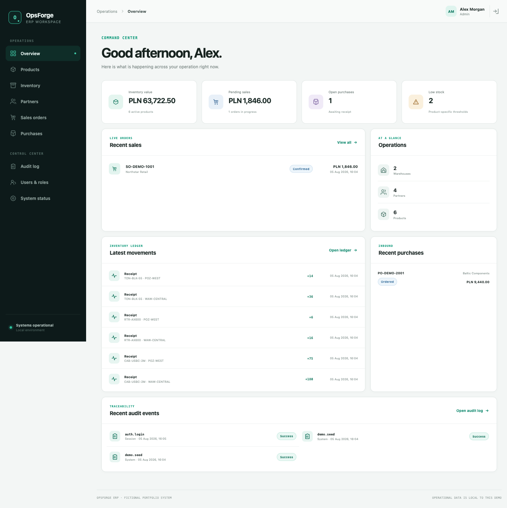
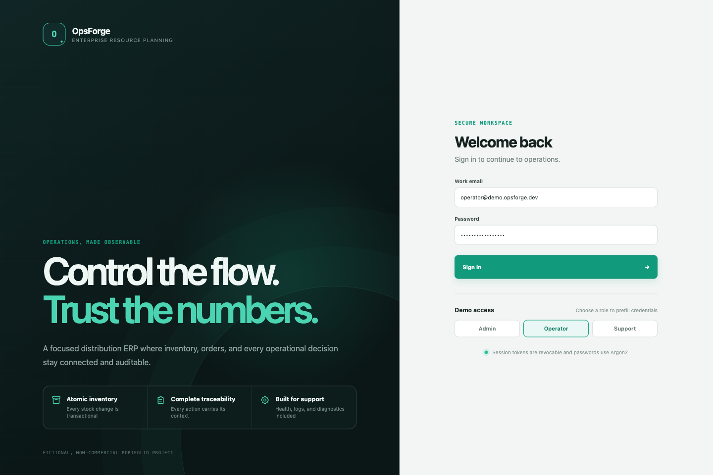
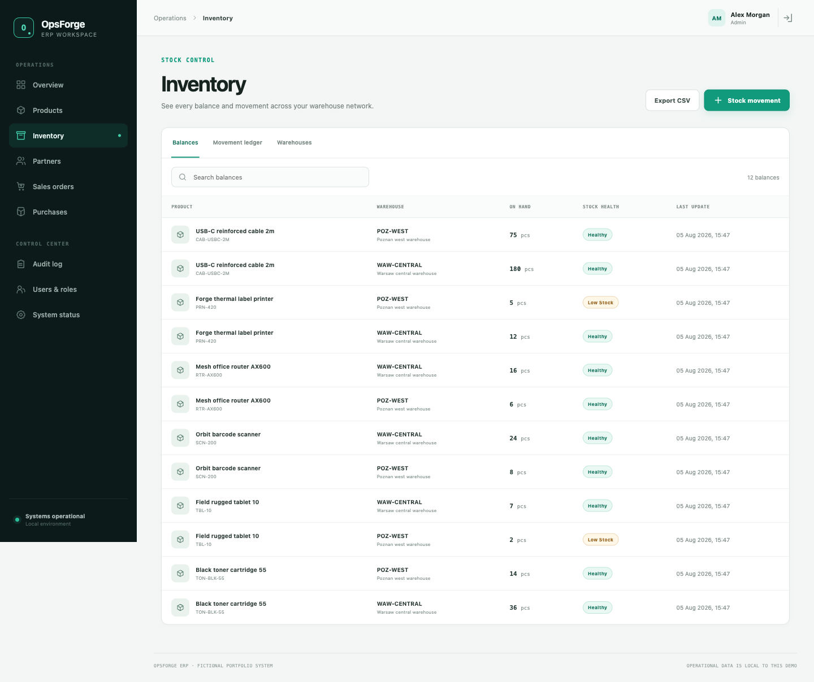
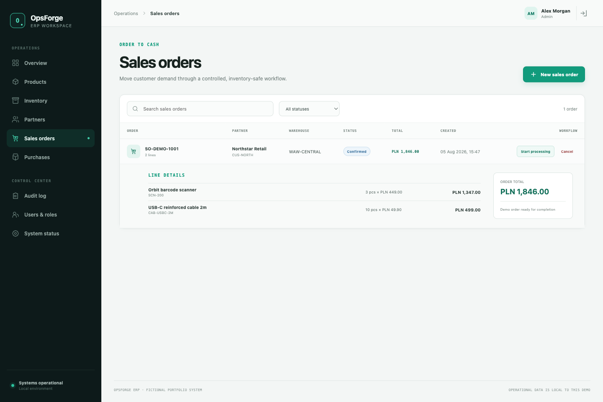
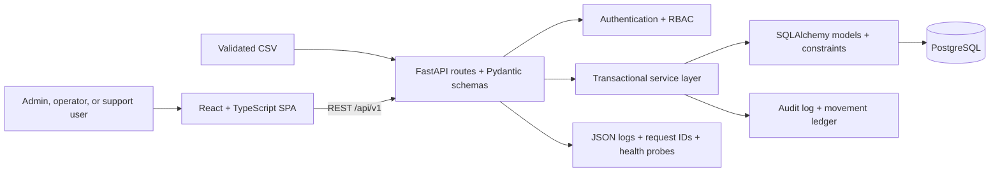

# OpsForge ERP

[](https://github.com/madara66613/opsforge-erp/actions/workflows/ci.yml)

A compact, production-like ERP and inventory system for a fictional small distributor. OpsForge demonstrates transactional stock control, sales and purchasing workflows, backend-enforced roles, auditability, support diagnostics, automated testing, and one-command containerized delivery.



> **Portfolio project:** OpsForge ERP simulates realistic business and support workflows. It has no commercial users, company deployment, or production revenue, and it does not claim enterprise-scale performance.

## Business problem

Small distribution teams need one trustworthy view of products, warehouse balances, customer demand, supplier replenishment, and the operational decisions that changed stock. Spreadsheet-only workflows make duplicate processing, negative inventory, unclear ownership, and weak incident evidence easy.

OpsForge puts those workflows behind explicit state machines and database transactions. Every protected action is authorized by the API, stock-changing operations update their ledger and balance atomically, and important successes and failures leave an audit trail with a request correlation ID.

## Implemented workflows

| Area | What is implemented |
| --- | --- |
| Identity | Argon2 password hashing, revocable opaque bearer sessions, admin/operator/support roles |
| Catalog | Products with unique SKU, prices, unit, active status, and product-specific reorder threshold |
| Inventory | Two-or-more warehouses, balances, receipts, issues, adjustments, transfers, returns, and admin-only negative override |
| Partners | Customer, supplier, or combined partner records with contact and tax details |
| Sales | `draft → confirmed → processing → completed` or cancelled; completion issues stock atomically |
| Purchasing | `draft → ordered → received` or cancelled; receipt adds stock atomically and tracks expected delivery |
| Reliability | Persisted idempotency keys prevent repeated completion or receipt from duplicating stock mutations |
| Audit | Actor, action, entity, outcome, request ID, timestamp, and safe metadata for business and authentication events |
| Dashboard | Live counts, inventory value, pending sales value, low-stock balances, recent orders, and movements |
| CSV | Atomic product import, product export, inventory export, exact header/value validation, and sample input |
| Operations | JSON request logs, correlation IDs, liveness/readiness/version probes, deterministic demo seed, and support runbook |

Search, status filters, pagination metadata, loading/empty/error states, and permission-aware controls are included across the principal API and UI lists.

## Screenshots

| Secure local demo login | Inventory across warehouses |
| --- | --- |
|  |  |

### Auditable sales workflow



## Architecture

OpsForge is a modular monolith: small enough to run and explain locally, but split into clear transport, business, persistence, and presentation boundaries.



Stock-changing services lock affected rows and commit balances, movements, order state, idempotency records, and audit evidence as one transaction. PostgreSQL is the runtime source of truth; Alembic owns every schema change. See [architecture](docs/architecture.md), [data model](docs/data-model.md), and [business rules](docs/business-rules.md).

## Technology stack

| Layer | Technology |
| --- | --- |
| Backend | Python 3.12, FastAPI, Pydantic, SQLAlchemy 2, Uvicorn |
| Database | PostgreSQL 17, Alembic, Psycopg 3 |
| Frontend | React 19, TypeScript, Vite, Wouter, CSS design system, Nginx |
| Authentication | Argon2 via `pwdlib`, hashed opaque sessions, permission dependencies |
| Quality | pytest, Ruff, mypy, Vitest, Testing Library, ESLint, Playwright |
| Delivery | Docker, Docker Compose, GitHub Actions |

## Local setup

Prerequisite: Docker Desktop, OrbStack, or another Docker engine with Compose.

```bash
git clone https://github.com/madara66613/opsforge-erp.git
cd opsforge-erp
cp .env.example .env
docker compose up -d --build
docker compose exec -T backend python -m app.db.seed
```

Open:

- application: <http://localhost:3000>
- interactive API documentation: <http://localhost:8000/docs>
- ReDoc: <http://localhost:8000/redoc>
- readiness probe: <http://localhost:8000/ready>

The first startup applies all migrations automatically. PostgreSQL data persists in the named `opsforge_db` volume.

## Demo credentials

| Role | Email | Local-only password | Intended demonstration |
| --- | --- | --- | --- |
| Admin | `admin@demo.opsforge.dev` | `AdminDemo!2026` | Full workflow, users, audit, override controls |
| Operator | `operator@demo.opsforge.dev` | `OperatorDemo!2026` | Products, partners, inventory, sales, purchasing |
| Support | `support@demo.opsforge.dev` | `SupportDemo!2026` | Read-only data, CSV export, audit, system diagnostics |

These are deterministic credentials for local/test seed data only. They are intentionally visible and are unsuitable for any shared or production environment.

## Useful commands

```bash
# Start or rebuild the complete stack
docker compose up -d --build

# Re-run the idempotent local demo seed
docker compose exec -T backend python -m app.db.seed

# Inspect service health and recent logs
docker compose ps
docker compose logs --since=10m backend db frontend

# Stop containers while preserving PostgreSQL data
docker compose down
```

For host-based development with Python 3.12+ and Node.js 22+:

```bash
make bootstrap
make check
```

## Tests and quality gates

The current release includes 23 backend API/service tests, 4 frontend interaction tests, and a complete Playwright business-flow test. Tests focus on authorization, invalid input, transaction rollback, negative-stock protection, duplicate-processing protection, audit creation, CSV atomicity, and real user behavior.

```bash
# CI-aligned lint, format, type, unit/API tests, and production build
make check

# Full browser flow against a healthy, seeded Compose stack
npm --prefix frontend run test:e2e

# Dependency audit used for this release
npm --prefix frontend audit --audit-level=high
```

The E2E scenario logs in, creates a unique product, receives 12 units, completes a 2-unit sales order, verifies the remaining 10 units, and finds the successful audit event. Read the [test strategy](docs/test-strategy.md) for the risk matrix and known coverage limits.

## Database migrations

The backend container runs `alembic upgrade head` before the API starts. Manual inspection commands are:

```bash
docker compose exec -T backend alembic current
docker compose exec -T backend alembic history
docker compose exec -T backend alembic check
```

Release verification also rebuilds a database from an empty named volume and confirms that the ORM produces no uncommitted migration operations.

## Demo data seed

`python -m app.db.seed` is deterministic and restricted to `local` or `test`. It can be rerun safely and creates three role accounts, six products, two warehouses, four partners, twelve product/warehouse balances, opening movements, representative audit entries, one sales order, and one purchase order.

## CSV import and export

Admins and operators can import products; all three roles can export products and inventory. The importer requires UTF-8, a 2 MB maximum, exact headers, valid values, and unique SKUs. It validates the whole file before creating any product or warehouse balance.

Start with [`samples/products.csv`](samples/products.csv) and read the [CSV guide](docs/csv-guide.md) before changing columns.

## Support and diagnostics

- `GET /health` proves the API process is alive without depending on PostgreSQL.
- `GET /ready` performs a database query and returns `503` when the required dependency is unavailable.
- `GET /version` exposes non-secret build identity.
- Every response includes `X-Request-ID`; accepted caller IDs use a restricted format and invalid values are regenerated.
- Structured JSON access logs include timestamp, level, method, path, status, duration, request ID, and authenticated user ID when available.
- The UI contains a system-status page and support has read-only access to audit evidence.

The [support runbook](docs/support-runbook.md) covers seven failure scenarios with symptoms, diagnostic commands, safe recovery, and escalation criteria.

## Security baseline

- passwords are Argon2 hashes and raw passwords are never persisted;
- only a SHA-256 digest of each opaque session token is stored;
- role checks run on the backend even when the UI hides unauthorized actions;
- request schemas prevent mass assignment of model fields;
- CORS origins and secrets come from environment configuration;
- known default secrets are rejected outside local/test environments;
- API errors do not expose internal tracebacks;
- logs and audit metadata exclude passwords, tokens, and uploaded CSV contents.

This is a reasonable portfolio baseline, not a formal security audit or compliance claim.

## Repository layout

```text
backend/                 FastAPI app, domain services, models, Alembic, pytest
frontend/                React UI, Vitest tests, Playwright E2E, Nginx image
docs/                    Architecture, rules, test strategy, runbook, screenshots
samples/                 Valid product CSV example
scripts/                 Reproducible bootstrap and quality commands
.github/workflows/       CI for backend, migrations, frontend tests, and build
compose.yaml             PostgreSQL + backend + frontend topology
```

## Key engineering decisions

- **Modular monolith over microservices:** one deployable backend keeps the MVP understandable while services preserve domain boundaries.
- **Balance plus immutable ledger:** current balances make reads practical; stock movements and audit events preserve traceability.
- **Database transaction boundaries:** order completion and purchase receipt cannot partially mutate stock.
- **Persisted idempotency:** a repeated completion/receipt request returns the original result; a conflicting reuse is rejected.
- **Backend-authoritative permissions:** frontend gating improves clarity but is never treated as a security control.
- **Strict atomic CSV import:** invalid rows are corrected at the source rather than cleaned up after partial writes.

## Known limitations

- Local Docker Compose is the only maintained deployment target; there is no hosted public demo.
- Authentication does not include OIDC, MFA, password reset, or email delivery.
- Sales confirmation does not reserve stock; inventory is validated and issued at completion.
- Orders use a single `PLN` currency and do not support partial shipment, partial receipt, tax accounting, invoicing, or payment processing.
- The UI is optimized for a focused demo dataset; high-volume virtualized tables and performance/load claims are out of scope.
- Automated browser coverage targets Chromium, and concurrency has not been load-tested.
- Accounting, payroll, multi-tenancy, integrations, and formal compliance are intentionally excluded.

## Roadmap

Planned, not implemented:

- stock reservation, backorders, and partial fulfillment;
- partial purchase receipts and supplier lead-time reporting;
- richer server-side sorting and saved operational filters;
- password reset and optional external identity integration;
- expanded cross-browser and concurrency testing;
- a small hosted read-only demonstration environment.

Kubernetes, Kafka, microservices, generative AI, full accounting, and payroll are deliberately not MVP priorities.

## Recruiter demo flow

A practical five-minute walkthrough:

1. Start Compose, seed data, and sign in as admin.
2. Show dashboard values coming from PostgreSQL, then open inventory and identify a low-stock balance.
3. Create a product and post a 12-unit receipt into `WAW-CENTRAL`.
4. Create a 2-unit sales order, move it through confirmation and processing, then complete it.
5. Return to inventory and verify 10 units remain.
6. Open the audit log and find `sales_order.complete` using its successful outcome and request ID.
7. Sign in as support to demonstrate read-only navigation, CSV export, audit access, and system probes.

The automated Playwright test executes the core of this same flow.

## CV-ready description

> Built OpsForge ERP, a Dockerized FastAPI/React/PostgreSQL portfolio system for multi-warehouse inventory, sales, purchasing, RBAC, and audit workflows. Implemented transactional stock mutations, idempotent order processing, Alembic migrations, deterministic demo data, atomic CSV transfer, structured diagnostics, and automated pytest/Vitest/Playwright quality gates in GitHub Actions.

## Project status and documentation

Version **1.0.0 portfolio release** implements the scoped ERP MVP. Future items are explicitly separated in the roadmap; the project is not presented as commercial software or a finished enterprise ERP.

- [Release notes](docs/release-notes-v1.0.0.md)
- [Architecture](docs/architecture.md)
- [Authorization model](docs/authorization.md)
- [Business rules](docs/business-rules.md)
- [Data model](docs/data-model.md)
- [CSV guide](docs/csv-guide.md)
- [Test strategy](docs/test-strategy.md)
- [Support runbook](docs/support-runbook.md)
- [Delivery milestones](docs/milestones.md)
- [MIT license](LICENSE)
