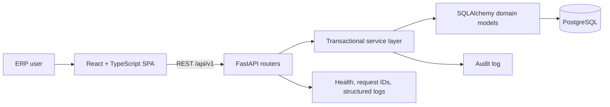

# Architecture

OpsForge ERP is a deliberately compact modular monolith. It keeps deployment simple while preserving explicit boundaries between transport, business rules, persistence, and presentation.

## Boundaries

- `backend/app/api` owns HTTP validation, status codes, and pagination contracts.
- `backend/app/services` owns authorization-aware business transactions and invariants.
- `backend/app/models` owns relational persistence models and database constraints.
- `frontend/src` owns user workflows and never reimplements authoritative business rules.
- PostgreSQL is the source of truth; Alembic is the only supported schema-change mechanism.

## Operational principles

- Stock-changing workflows lock affected balance rows and commit movement, balance, order state, and audit records atomically.
- Request IDs are accepted only in a restricted format or regenerated, returned in responses, and included in JSON logs.
- Liveness does not depend on downstream services; readiness verifies database connectivity.
- Secrets are supplied through environment variables and are never written to logs or audit payloads.

## Deliberate scope

This portfolio project excludes accounting, payroll, Kubernetes, service decomposition, message brokers, and broad third-party integrations. Those would obscure the core operational workflows without improving this project's hiring signal.

