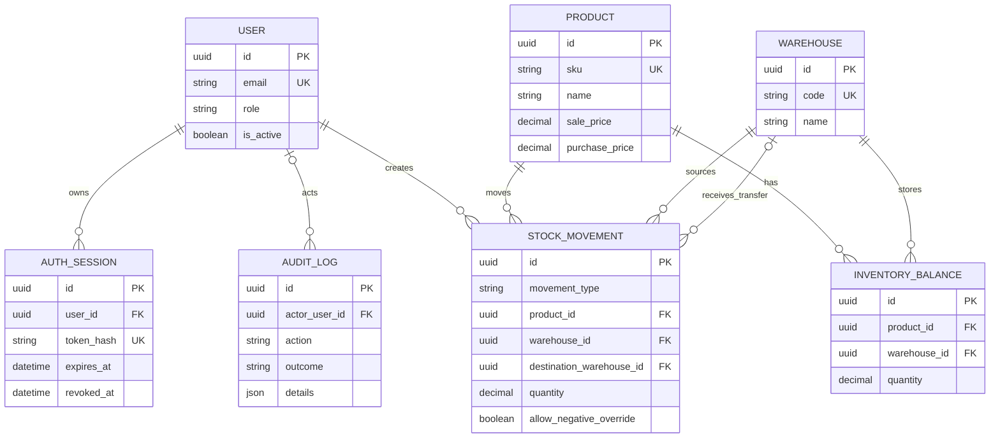

# Data model

The diagram shows the persisted model through the inventory milestone. UUID primary keys make demo data stable and avoid exposing sequential record volume.

`inventory_balances(product_id, warehouse_id)` is unique. It is a transactionally maintained current-state projection; `stock_movements` is the operational history used for traceability.

