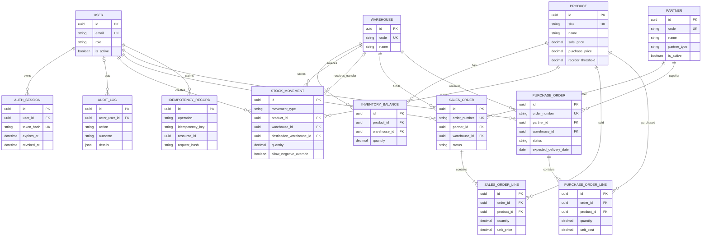

# Data model

The diagram shows the persisted model through the transactional order milestone. UUID primary keys make demo data stable and avoid exposing sequential record volume.

`inventory_balances(product_id, warehouse_id)`, each order line's `(order_id, product_id)`, and `idempotency_records(operation, idempotency_key)` are unique. Inventory balances are a transactionally maintained current-state projection; stock movements and audit logs retain the operational history used for traceability.
